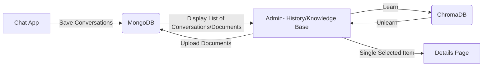
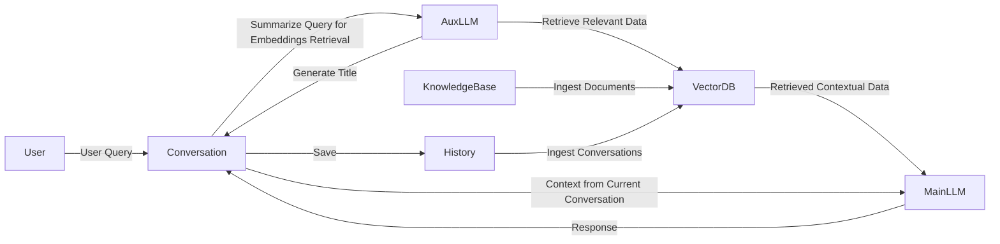

# Admin console

## GUI for administration

## How to use Admin MongoDB console?

- 'Knowledge base' page displays documents for embeddings
- 'History' page displays conversations of user with option to delete and learn from them
- To use 'Selection actions' buttons, select any number of rows in grid
- To access details of record, select row and click 'Details' under grid

Use Streamlit as basic visual component.

- Side menu with Sub-Pages should be accesible after start of the app and on every Sub-Page
- We'll need to score answers.
- Both Chat App and Admin App need to run simultaneously (different containers)

## Admin APP flow

## RAG LLM chain diagram

