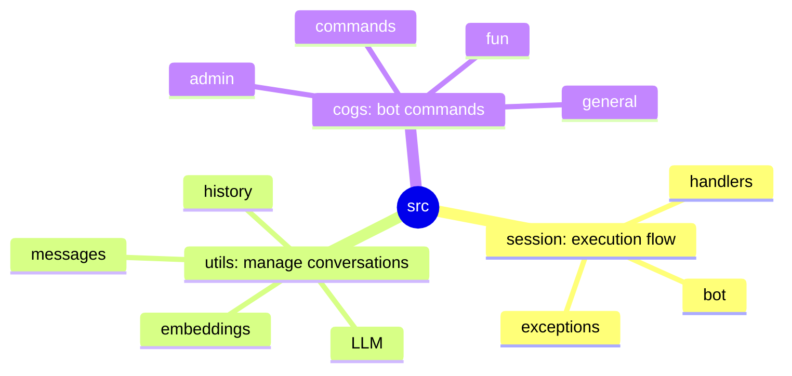

# Discord chatbot for RAG project

## Main component

Discord bot to be placed to server and connect to RAG agent.

- Use MongoDB as storage for chat history (with Discord flag == True)
- We'll need to score answers (message reaction)
- Good/bad answers will be used for fine-tuning of RAG.
- Integration should be done via docker (docker-compose)
- Chat context must be separate for different users

## Project structure

## Discord communication scenarios

[@message in #channel]  --> Thread answer
[Thread in #channel added @agentkovac]  --> Thread answer
[DM @agentkovac]    --> Reply in DM
[/agent MSG]    --> Reply in DM
[/agent help]   --> Reply in DM