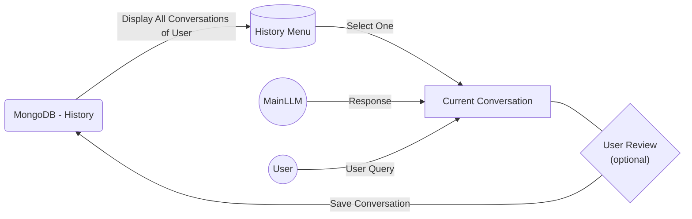
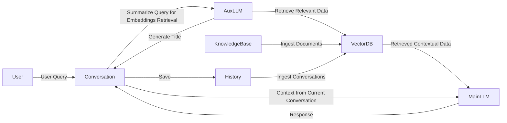

# Chat client for RAG project

## Main component

Use Streamlit as basic visual component.

- Use MongoDB as storage for chat history.
- We'll need to score answers.
- Good/bad answers will be used for fine-tuning of RAG.
- Integration should be done via docker (docker-compose)

## Chat APP flow

## RAG LLM chain diagram

